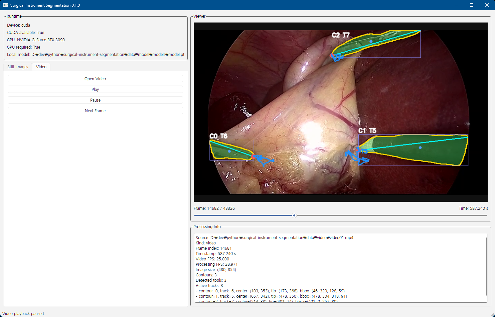

# Surgical Instrument Segmentation and Tip Tracking

Python desktop application for surgical instrument segmentation, contour-based axis extraction, tip detection, and video tip tracking.

The project uses the `MONAI/endoscopic_tool_segmentation` model on GPU and provides a PyQt6 GUI for:

- single still-image processing
- folder-based sequential still-image review
- video playback with frame stepping
- contour, axis, tip, and trajectory overlays

## Features

- GPU-first MONAI segmentation
- local model loading from `data/model/models/model.pt`
- contour extraction from binary tool masks
- virtual center-axis estimation using contour geometry
- tip selection based on proximity to the image center
- multi-tool tip tracking for video
- still-image and video workflows in one desktop UI
- frame slider for video seek and frame position awareness
- per-frame processing FPS display for video



## Requirements

- Windows
- Python 3.12
- NVIDIA GPU with CUDA support
- `uv` installed and available on `PATH`
- Hugging Face token stored in `.env`
- TensorRT is optional, but required for `.trt` export and TensorRT speed comparison

## Project Layout

```text
app/
  config/
  domain/
  gui/
  pipelines/
  scripts/
  services/
  main.py
data/
  model/
install.bat
run-app.bat
run-convert.bat
run-speed.bat
pyproject.toml
```

## Installation

1. Create `.env` from `.env.sample`.
2. Put your Hugging Face token in `.env`.

Example:

```ini
huggingface_token=hf_xxxxxxxxxxxxxxxxxxxx
```

1. Run:

```bat
install.bat
```

`install.bat` does the following:

- creates `.venv` with Python 3.12 if needed
- runs `uv sync --extra dev`
- downloads the MONAI model
- verifies CUDA availability in PyTorch

## TensorRT Installation

TensorRT is not installed by `install.bat`. Install it manually if you want to:

- convert `model.onnx` to TensorRT engines
- compare PyTorch `.pt` inference against TensorRT `.trt` engines

### Windows install notes

1. Download the Windows x64 TensorRT package that matches your installed CUDA major line.
2. Extract it to a stable location such as `C:\TensorRT-10.16.1.11`.
3. Make sure `trtexec.exe` is available in one of these ways:
   - add the TensorRT `bin` directory to `PATH`
   - set `TRTEXEC_PATH` to the full `trtexec.exe` path
   - pass `--trtexec` directly to `scripts.convert_to_tensorrt`

### Version matching is important

The TensorRT engine file is version-sensitive.

- The `trtexec.exe` version used to build the `.trt` engines
- and the Python `tensorrt` package version used to load those `.trt` engines

must match closely, ideally exactly.

If they do not match, TensorRT engine deserialization will fail during speed comparison.

Example:

- build with `C:\TensorRT-10.16.1.11\bin\trtexec.exe`
- run comparison in a Python environment with `tensorrt 10.16.1.11`

## Model Location

The application loads the model from:

```text
data/model/models/model.pt
```

Related conversion outputs use:

```text
data/model/models/model.onnx
data/model/models/model-fp32.trt
data/model/models/model-fp16.trt
data/model/models/model-int8.trt
```

The download step is implemented in [app/scripts/download_models.py](./app/scripts/download_models.py).

## Run

```bat
run-app.bat
```

This launches the PyQt6 application through [app/main.py](./app/main.py).

## Model Conversion And Benchmarking

### Generate ONNX and TensorRT models in one run

```bat
run-convert.bat
```

This script does the following:

- creates `data/model/models/model.onnx` from `data/model/models/model.pt` if the ONNX file does not already exist
- creates `data/model/models/model-fp32.trt` if it does not already exist
- creates `data/model/models/model-fp16.trt` if it does not already exist
- creates `data/model/models/model-int8.trt` if it does not already exist
- skips any output file that already exists

Internally it uses:

- `scripts.convert_to_onnx`
- `scripts.convert_to_tensorrt`

### Export the MONAI PyTorch model to ONNX manually

```bat
.\.venv\Scripts\python.exe -m scripts.convert_to_onnx
```

This converts:

```text
data/model/models/model.pt
```

to:

```text
data/model/models/model.onnx
```

Useful options:

- `--output`
- `--input-height`
- `--input-width`
- `--opset`

### Export the ONNX model to TensorRT manually

```bat
.\.venv\Scripts\python.exe -m scripts.convert_to_tensorrt
```

This converts:

```text
data/model/models/model.onnx
```

to:

```text
data/model/models/model-fp32.trt
```

Useful options:

- `--trtexec C:\TensorRT-10.16.1.11\bin\trtexec.exe`
- `--fp16`
- `--int8`
- `--min-batch 1 --opt-batch 1 --max-batch 1`
- `--workspace 4096`

Example:

```bat
.\.venv\Scripts\python.exe -m scripts.convert_to_tensorrt --trtexec C:\TensorRT-10.16.1.11\bin\trtexec.exe --fp16
```

This example writes an FP16 engine. To create all three TensorRT engines in one run, prefer `run-convert.bat`.

### Compare PyTorch and TensorRT inference speed

```bat
run-speed.bat
```

or:

```bat
.\.venv\Scripts\python.exe -m scripts.compare_speed
```

This compares:

- `data/model/models/model.pt`
- `data/model/models/model-fp32.trt`
- `data/model/models/model-fp16.trt`
- `data/model/models/model-int8.trt`

using the same CUDA input tensor and prints:

- output shape
- max and mean absolute output difference
- latency per batch
- latency per image
- throughput in images per second

Useful options:

- `--batch-size 1`
- `--warmup 20`
- `--iterations 100`
- `--trt-fp32-path data/model/models/model-fp32.trt`
- `--trt-fp16-path data/model/models/model-fp16.trt`
- `--trt-int8-path data/model/models/model-int8.trt`
- `--skip-accuracy-check`

Example benchmark result:

```text
engine            output_shape        max_abs_diff  mean_abs_diff
--------------------------------------------------------------------
tensorrt_fp32     (1, 2, 480, 736)        0.036263       0.003089
tensorrt_fp16     (1, 2, 480, 736)        0.220657       0.021721
tensorrt_int8     (1, 2, 480, 736)       14.720551       3.403430

benchmark           ms/batch    ms/image    images/s
------------------------------------------------------
pytorch_pt             8.360       8.360      119.62
tensorrt_fp32          4.815       4.815      207.67
tensorrt_fp16          2.991       2.991      334.30
tensorrt_int8          2.238       2.238      446.83
```

### Detect tip from the command line

Use `scripts.detect_tip` when you want the fastest non-GUI tip detection path for one image or one video.

### Execution Examples

#### Single Image

```bat
.\.venv\Scripts\python.exe -m scripts.detect_tip --model data/model/models/model.pt --image data/image/val/VID23_t50_full/img_dir/t50_VID23_000000.png
```

Output:

```json
{"event": "model_loaded", "runtime": "pt", "model_path": "data\\model\\models\\model.pt", "load_time_ms": 2180.898}
{"event": "image_result", "input_path": "data\\image\\val\\VID23_t50_full\\img_dir\\t50_VID23_000000.png", "processing_time_ms": 234.612, "tools": [{"contour_index": 0, "track_id": null, "tip": [382, 259], "center": [249, 244], "bounding_box": [135, 197, 249, 95]}]}
```

#### Image Folder

```bat
.\.venv\Scripts\python.exe -m scripts.detect_tip --model data/model/models/model.pt --image data/image/val/VID23_t50_full/img_dir
```

Output:

```json
{"event": "model_loaded", "runtime": "pt", "model_path": "data\\model\\models\\model.pt", "load_time_ms": 2145.177}
{"event": "image_result", "input_path": "data\\image\\val\\VID23_t50_full\\img_dir\\t50_VID23_000000.png", "processing_time_ms": 237.719, "tools": [{"contour_index": 0, "track_id": null, "tip": [382, 259], "center": [249, 244], "bounding_box": [135, 197, 249, 95]}]}
{"event": "image_result", "input_path": "data\\image\\val\\VID23_t50_full\\img_dir\\t50_VID23_000001.png", "processing_time_ms": 23.867, "tools": [{"contour_index": 0, "track_id": null, "tip": [385, 272], "center": [250, 262], "bounding_box": [135, 212, 251, 95]}]}
{"event": "image_result", "input_path": "data\\image\\val\\VID23_t50_full\\img_dir\\t50_VID23_000002.png", "processing_time_ms": 21.675, "tools": [{"contour_index": 0, "track_id": null, "tip": [346, 316], "center": [237, 307], "bounding_box": [139, 259, 209, 98]}, {"contour_index": 1, "track_id": null, "tip": [480, 37], "center": [534, 16], "bounding_box": [479, 2, 123, 38]}]}
{"event": "image_result", "input_path": "data\\image\\val\\VID23_t50_full\\img_dir\\t50_VID23_000003.png", "processing_time_ms": 21.114, "tools": [{"contour_index": 0, "track_id": null, "tip": [334, 326], "center": [234, 324], "bounding_box": [141, 272, 194, 107]}, {"contour_index": 1, "track_id": null, "tip": [534, 23], "center": [569, 13], "bounding_box": [534, 2, 86, 31]}]}
{"event": "image_result", "input_path": "data\\image\\val\\VID23_t50_full\\img_dir\\t50_VID23_000004.png", "processing_time_ms": 22.766, "tools": [{"contour_index": 0, "track_id": null, "tip": [350, 336], "center": [249, 348], "bounding_box": [152, 305, 199, 95]}]}
{"event": "image_result", "input_path": "data\\image\\val\\VID23_t50_full\\img_dir\\t50_VID23_000005.png", "processing_time_ms": 21.867, "tools": [{"contour_index": 0, "track_id": null, "tip": [348, 350], "center": [247, 350], "bounding_box": [149, 306, 200, 93]}, {"contour_index": 1, "track_id": null, "tip": [447, 44], "center": [511, 20], "bounding_box": [447, 2, 138, 49]}]}
...
```

#### Video

```bat
.\.venv\Scripts\python.exe -m scripts.detect_tip --model data/model/models/model-fp16.trt --video data/video01.mp4
```

Output:

```json
{"event": "model_loaded", "runtime": "trt", "model_path": "data\\model\\models\\model-fp16.trt", "load_time_ms": 188.2}
{"event": "video_frame", "input_path": "data\\video01.mp4", "frame_index": 0, "timestamp_s": 0.0, "fps": 9.415, "tools": [{"contour_index": 0, "track_id": 1, "tip": [394, 66], "center": [437, 29], "bounding_box": [394, 2, 92, 65]}]}
{"event": "video_frame", "input_path": "data\\video01.mp4", "frame_index": 1, "timestamp_s": 0.04, "fps": 90.063, "tools": [{"contour_index": 0, "track_id": 1, "tip": [391, 69], "center": [437, 30], "bounding_box": [391, 2, 100, 68]}]}
{"event": "video_frame", "input_path": "data\\video01.mp4", "frame_index": 2, "timestamp_s": 0.08, "fps": 90.229, "tools": [{"contour_index": 0, "track_id": 1, "tip": [386, 74], "center": [437, 31], "bounding_box": [386, 2, 109, 73]}]}
{"event": "video_frame", "input_path": "data\\video01.mp4", "frame_index": 3, "timestamp_s": 0.12, "fps": 94.047, "tools": [{"contour_index": 0, "track_id": 1, "tip": [381, 77], "center": [433, 32], "bounding_box": [381, 2, 112, 76]}]}
{"event": "video_frame", "input_path": "data\\video01.mp4", "frame_index": 4, "timestamp_s": 0.16, "fps": 93.522, "tools": [{"contour_index": 0, "track_id": 1, "tip": [372, 80], "center": [424, 33], "bounding_box": [372, 2, 111, 79]}]}
{"event": "video_frame", "input_path": "data\\video01.mp4", "frame_index": 5, "timestamp_s": 0.2, "fps": 103.126, "tools": [{"contour_index": 0, "track_id": 1, "tip": [367, 80], "center": [420, 33], "bounding_box": [367, 2, 112, 79]}]}
...
```

## GUI Overview

### Still Images tab

- `Open Image`: process one image immediately
- `Open Folder`: load a folder of still images
- `Previous Image` / `Next Image`: move through the loaded folder
- `Process Folder Sequence`: start sequential processing from the currently selected folder image
- `Stop Process`: stop folder processing after the current image finishes
- `Folder Images`: select an image directly from the folder list

### Video tab

- `Open Video`: load a video file
- `Play`: continuous frame processing and playback
- `Pause`: stop playback
- `Next Frame`: process exactly one more frame
- frame slider below the viewer:
  - shows current frame position
  - supports fast seeking
  - shows current timestamp

### Viewer overlays

- green mask overlay for segmentation
- gold contour outlines
- cyan axis line
- red tip marker
- track trajectory in dodger-blue
- contour and track labels

### Processing Info

The panel below the viewer shows:

- source path
- media kind
- frame index
- timestamp for video
- folder position for still-image sequences
- video FPS
- processing FPS
- contour count
- detected tool count
- per-tool geometry summary

## Processing Logic

### Segmentation

- input image is normalized to RGB
- image is resized for MONAI inference
- foreground probability map is generated on GPU
- mask is resized back to original image size
- thresholding produces a binary tool mask

### Geometry

For each contour:

1. compute the contour center
2. find point `A`, the contour point farthest from the center
3. find point `B`, the contour point farthest from `A`
4. define line `A-B` as the virtual tool center axis
5. choose the endpoint closer to image center as the tip

### Tracking

Video tracking uses a simple nearest-neighbor matcher based on:

- tip distance
- center distance

Each track keeps:

- stable `track_id`
- last tip
- last center
- short trajectory history

## Main Modules

- [app/services/segmentation/monai_segmenter.py](./app/services/segmentation/monai_segmenter.py)
  GPU segmentation and local model loading

- [app/services/geometry/tool_geometry.py](./app/services/geometry/tool_geometry.py)
  mask cleanup, contour extraction, axis and tip computation

- [app/services/tracking/simple_tracker.py](./app/services/tracking/simple_tracker.py)
  lightweight video tracking

- [app/services/rendering/overlay_renderer.py](./app/services/rendering/overlay_renderer.py)
  visualization overlay rendering

- [app/pipelines/image_pipeline.py](./app/pipelines/image_pipeline.py)
  still-image pipeline

- [app/pipelines/video_pipeline.py](./app/pipelines/video_pipeline.py)
  video session pipeline

- [app/gui/main_window.py](./app/gui/main_window.py)
  desktop application UI

## Notes

- GPU is treated as required for the intended workflow.
- Folder sequence processing runs on a background thread so the UI remains responsive.
- `Stop Process` stops after the current image finishes, not in the middle of GPU inference.
- The current tracker is intentionally simple and optimized for clarity and stability rather than advanced motion modeling.

## Troubleshooting

### Model file not found

Run:

```bat
install.bat
```

Then confirm the file exists at:

```text
data/model/models/model.pt
```

### CUDA not available

Check that:

- the NVIDIA driver is installed correctly
- your PyTorch CUDA build was installed successfully
- the GPU is visible to PyTorch

You can re-run:

```bat
install.bat
```

### ONNX export fails on import errors

If ONNX import fails during `scripts.convert_to_onnx`, the Python environment likely has an incompatible `onnx` dependency set.

Re-sync the environment:

```bat
uv sync --extra dev
```

Then try:

```bat
.\.venv\Scripts\python.exe -m scripts.convert_to_onnx
```

### TensorRT engine cannot be loaded

If `scripts.compare_speed` reports that the TensorRT engine cannot be deserialized:

- rebuild the affected `.trt` engine file
- make sure the `trtexec.exe` version matches the installed Python `tensorrt` runtime version
- verify the engine was built on a compatible NVIDIA GPU / TensorRT setup

### GUI freezes during very heavy processing

Still-image folder sequence processing already runs in a background thread, but video frame inference is still processed synchronously per frame. If needed, that can be moved to a worker thread in a future iteration.

## Developer Docs

See [DEVELOPMENT.md](./DEVELOPMENT.md) for the detailed design and implementation notes.
